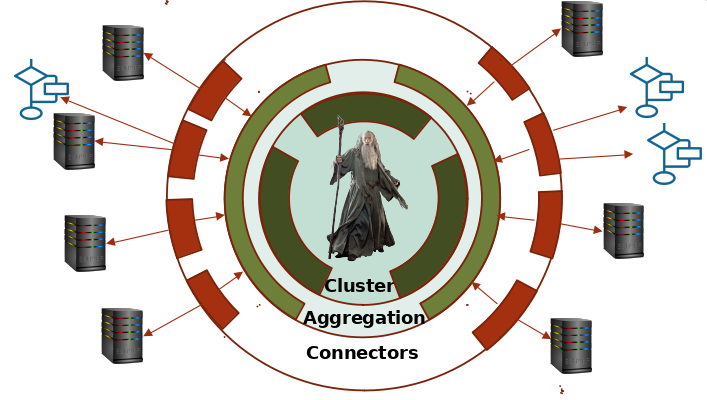

# Gandalf Core
La solution Gandalf (Gandalf is A Natural Devops Application Life-cycle Framework) a pour unique objectif de faciliter l’adoption du DevOps sur tout le cycle de vie DevOps sans imposer de choix ou présupposés technologiques ou de produits.

https://ditrit.io/gandalf/

## Schema :



## Architecture :

### Cluster :
Le cluster Gandalf trace et fait transiter les commandes et les événements.
### Aggregator :
Les agrégateurs Gandalf cloisonnent et simplifient l’architecture réseau.
### Connector : 
Les connecteurs Gandalf assurent la communication avec les briques du SI.   

## Build :

```bash
go build -tags libsqlite3
```

## Documentation

https://taiga.orness.com/project/xavier-namt/wiki/home


## CLI
L'ensemble d'une solution gandalf est piloté par un unique binaire **'gandalf'**.

gandalf mode command [options]
mode : connector|aggregator|cluster|agent

### Common options :
-c config_file
--config=config_file
config_file : default value is '/etc/gandalf.[json|ini|yaml]'

### Cluster mode usage :
usage:  
gandalf cluster init logical_name bind_address  
gandalf cluster join logical_name bind_address join_address  

*   init command is used to setup a new global Gandalf instance. Output provides the key to be used by super-admin.
*   join command is used to add a new member to an existing cluster


**Fichier de configuration gandalf en mode cluster (by exemple) :**

```bash
mode: cluster
logical_name: toto
bind_address: 192.168.22.10
[join_address : 192.168.22.11]
```

### Aggregator mode usage :
usage:  
gandalf aggregator init logical_name tenant bind_address link_address  
gandalf aggregator join logical_name tenant bind_address link_address join_address  


*   init command is used to setup a new aggregator group.
*   join command is used to add a new member to an existing group

**Fichier de configuration gandalf en mode aggregator (by exemple) :**

```bash
mode: aggregator
logical_name: toto
tenant: tata
bind_address: 192.168.22.10
link_address: 192.168.22.11
[join_address : 192.168.22.12]
```

### Connector mode usage :
usage:  
gandalf connector init logical_name tenant bind_address grpc_bind_address link_address  
gandalf connector join logical_name tenant bind_address grpc_bind_address link_address join_address  


*   init command is used to setup a new connector group.
*   join command is used to add a new member to an existing group

**Fichier de configuration gandalf en mode connector (by exemple) :**

```bash
mode: connector
logical_name: toto
tenant: tata
bind_address: 192.168.22.10
grpc_bind_address: 192.168.22.11
link_address: 192.168.22.12
[join_address : 192.168.22.12]
```

## Demo
```bash
Cluster :
./garcimore cluster init cluster 127.0.0.1:9000 &
./garcimore cluster join cluster 127.0.0.1:9001 127.0.0.1:9000 &
./garcimore cluster join cluster 127.0.0.1:9002 127.0.0.1:9000 &
```

```bash
Aggregator :
./garcimore aggregator init agg1 titi 127.0.0.1:8000 127.0.0.1:9000 &
./garcimore aggregator init agg2 titi 127.0.0.1:8100 127.0.0.1:9000 &
./garcimore aggregator join agg1 titi 127.0.0.1:8001 127.0.0.1:9000 127.0.0.1:8000 &
./garcimore aggregator join agg2 titi 127.0.0.1:8101 127.0.0.1:9000 127.0.0.1:8100 &
```

```bash
Connector :
./garcimore connector init con1 titi 127.0.0.1:7000 127.0.0.1:7010 127.0.0.1:8000 &
./garcimore connector init con2 titi 127.0.0.1:7100 127.0.0.1:7110 127.0.0.1:8100 &
./garcimore connector join con1 titi 127.0.0.1:7001 127.0.0.1:7011 127.0.0.1:8000 127.0.0.1:7000 &
./garcimore connector join con2 titi 127.0.0.1:7101 127.0.0.1:7111 127.0.0.1:8100 127.0.0.1:7100 &
```

```
Test Worker Command :
./garcimore test send cmd test test
./garcimore test receive cmd test
```

```
Test Worker Event :
./garcimore test send evt test test test
./garcimore test receive evt test test
```
## To Do

Test !!