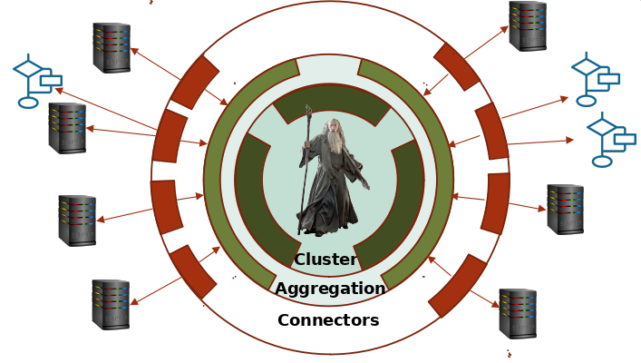

# Gandalf Core
Gandalf (Gandalf is A Natural Devops Application Life-cycle Framework), a tool to allow progressive DevOps adoption.

https://ditrit.io


## Table of content
- [Schema](#Schema)
- [Architecture](#Architecture)
- [Installation](#Installation)
- [Build](#Build)
- [Documentation](#Documentation)
- [Getting started](#Getting-started)


## Schema



## Architecture

### Cluster
The Gandalf cluster traces and routes commands and events.
### Aggregator
Gandalf aggregators silo and simplify the network architecture.
### Connector
Gandalf connectors ensure communication with the bricks of the IS.

## Installation

```
# Clone repository
git clone https://github.com/ditrit/gandalf
cd gandalf

# Installing go dependencies
go get
```

## Build

```bash
go build -o gandalf
```

## Documentation
[Wiki](https://github.com/ditrit/gandalf/wiki).

## Getting started

### Cluster : 

**Cluster initialisation**
```bash
./gandalf start cluster --offset 1 -l Cluster 
```
**CLI authentification**
```bash
./gandalf cli -e http://localhost:9200 login <login> <password>
```
**Create administrator** 
```bash
./gandalf cli -e http://localhost:9200 create user <username> <email> <password> -t <token>
```
**Cluster 2 declaration**
```bash
./gandalf cli -e http://localhost:9200 declare cluster member -t <token>
```
**Cluster 2 start** 
```bash
./gandalf start cluster --offset 2 -l Cluster --join 127.0.0.1:9100 --secret <secret>
```
**Cluster 3 declaration**
```bash
./gandalf cli -e http://localhost:9200 declare cluster member -t <token>
```
**Cluster 3 start**
```bash
./gandalf start cluster --offset 3 -l Cluster --join 127.0.0.1:9100 --secret <secret>
```

### Tenant : 

**Create tenant**
```bash
./gandalf cli -e http://localhost:9200 create tenant <tenant> -t <token>
```

### Aggregator : 
**CLI authentification**
```bash
./gandalf cli -e http://localhost:9203 login <login> <password>
```
**Aggregator declaration** 
```bash
./gandalf cli -e http://localhost:9203 declare aggregator member <tenant> <name> -t <token>
```
**Aggregator start** 
```bash
./gandalf start aggregator --offset 4 -l <name> -t <tenant> --cluster 127.0.0.1:9100 --secret <secret>
```

### Connector :
**Creation connector** 
```bash
./gandalf cli -e http://localhost:9203 declare connector name <tenant> <name> -t <token>
```

**Connector declaration** 
```bash
./gandalf cli -e http://localhost:9203 declare connector member <tenant> <name> -t <token>
```
**Connector start** 
```bash
./gandalf start connector --offset 5 -l <name> --aggregator 127.0.0.1:9103 --secret <secret> --class <class> --product <product>
```
